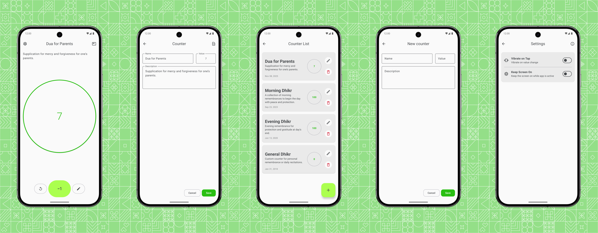

# Counter

Counter is a clean and modern digital counting app designed for everyday use. Whether you're performing tasbih, tracking repetitions, or counting daily tasks, the app provides a smooth and intuitive counting experience. When you open the app, it automatically loads your most recently used counter, so you can continue right where you left off. Navigation is simple and intuitive, allowing quick access to settings and all your counters whenever you need them.

## Screenshots

<picture>
  
</picture>

## Technologies Used

- **Kotlin**: The primary language used to build the app.
- **Jetpack Compose**: For creating a modern, intuitive, and reactive user interface.
- **Material Design 3 (Expressive)**: Ensures a clean, consistent, and contemporary visual experience.
- **Modern Android Architecture (MVVM)**: Provides a structured and maintainable foundation for UI state and data handling.
- **Coroutines**: Enables smooth, responsive performance through efficient background processing.
- **Navigation**: Handles transitions between screens in a simple and reliable way.
- **Room (Local Database)**: Persists counters and related data directly on the device.
- **DataStore**: Manages lightweight app preferences and settings.
- **Hilt (Dependency Injection)**: Keeps the codebase modular, scalable, and easy to maintain.
- **Firebase Analytics & Crashlytics**: Helps monitor app stability and understand user behavior.

## Installation

To explore or run the app locally:

1. Clone the repository.
2. Open the project in Android Studio.
3. Firebase setup:
    - Add your `google-services.json` file to `Counter/app/` after creating a Firebase project, **or**
    - Temporarily comment out Firebase dependencies in `Counter/app/build.gradle.kts` (lines 31–35 and 118–121) if Firebase isn’t needed while testing.
4. Build and run the app on an emulator or physical device.

## License

This project is licensed under the [Apache License 2.0](./LICENSE).
